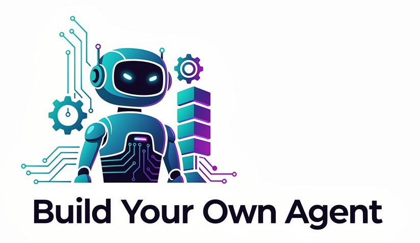
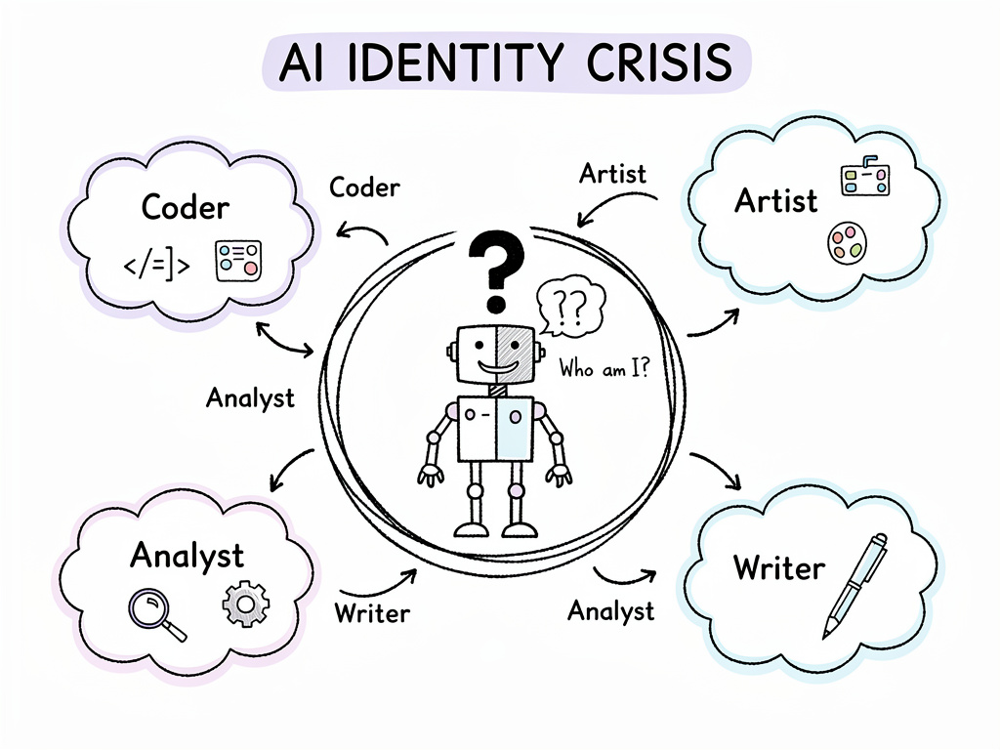
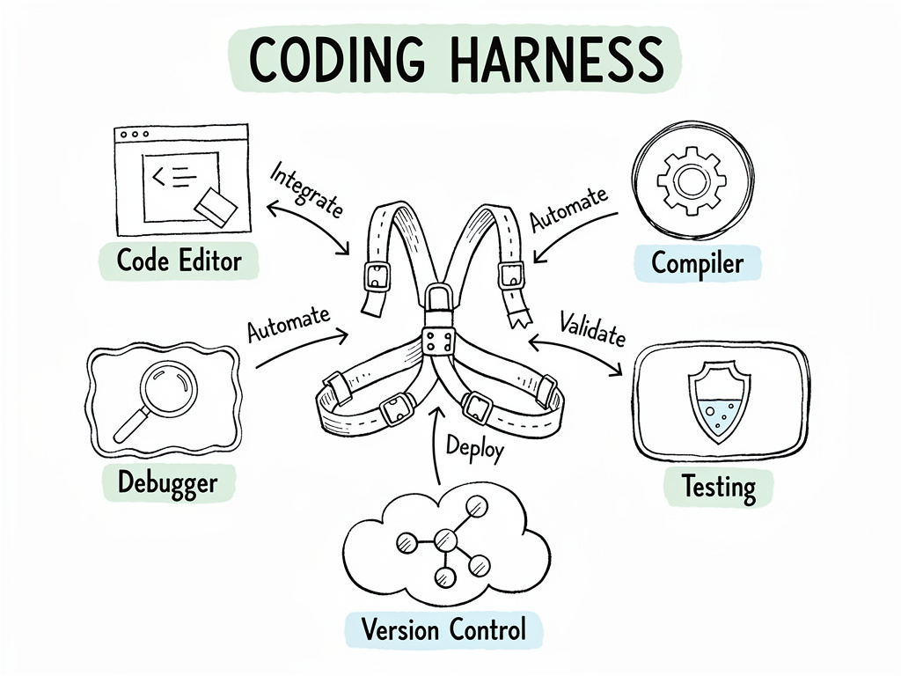
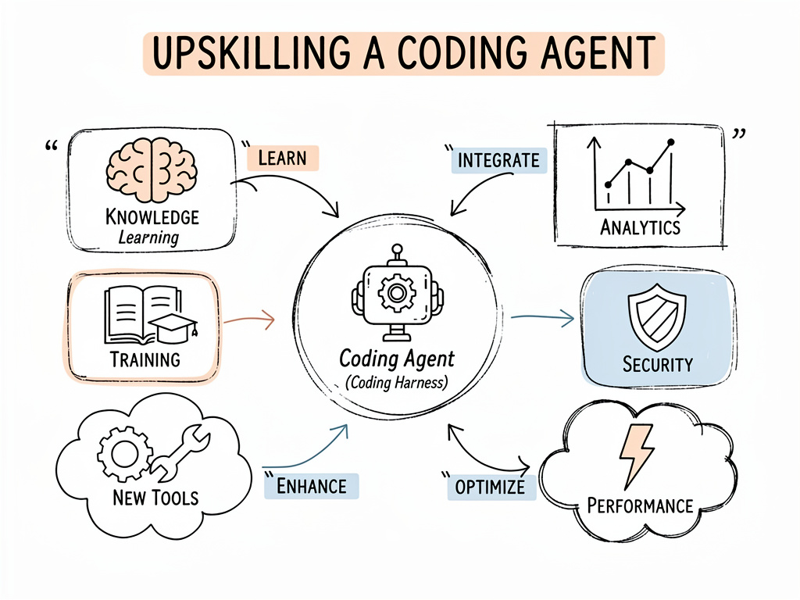

## Hands-on session

**Joris Gillis**
Software Engineer @ TrendMiner

---

# Before we start

## **Goal?**

1. Have some fun together
2. Write a skill, agent, or plugin for Claude Code
3. Exposure to ecosystem of agents

---

# Before we start

## **Topics**

1. Terminology
2. Coding Agents
3. How to build an agent/skill?
   a. Formats of agents
   b. Evaluation
   c. Distribution

---

# Terminology Folly

**Define agent**

---

# Agent

A software entity that **perceives its environment, reasons, and acts
autonomously** to achieve a **specific goal**. It uses tools, executes
actions, and **may interact with users**.

# Skill

A **self-contained, reusable capability that extends the agent** with
(domain-specific) instructions. Has a trigger description,
step-by-step instructions, and optionally bundled scripts/tools.
Think of it as a **“recipe” the agent follows**.

---

# Agents outside of Coding Agents

- Frameworks to build autonomous agents
  - LangChain
  - DSPy
  - Claude Agent SDK
  - ...

---

# Coding Agents

- Also called a **harness**
  - Claude Code, GitHub CoPilot, Codex, OpenCode, ...
  - Forge, Pi.dev, Mistral Vibe, ...
- General purpose
  - System prompt for coding
  - Not specific to your code base, style, guidelines, formatting, ...
- Make it your own: 
  - AGENTS.md, Skills, Subagents, etc

---

# AGENTS.md

- Describe
  - General guidelines
  - Project goal
  - Project structure

---

# Agent vs Skill vs Agent Skill vs Subagent

- **Agent**:
  - `/agents`
  - Separate context, different model
  - Use: when output of agent is small compared to input
  - E.g., code review -> reads many files, has small list of comments
- **Skill**
  - `/skills`
  - Works in main context
  - SKILL.md + references + scripts + extra
  - Use: add domain-specific knowledge to the main context
  - E.g., test-driven development -> change behaviour of the agent

---

# How to write a skill?

- Start: /skill-creator (skill in Claude Code)
- [Claude documentation](https://code.claude.com/docs/en/skills)
- **Evals**!
  - built into skill-creator
  - [promptfoo](https://www.promptfoo.dev/)
  
---

# Exercises

- Examples to start from
  - Commit Ghostwriter
  - Pythonic Code Reviewer
  - Journal Buddy
  - Ticket Prep
- Ideas
  - PR Review: prioritize code reviews
  - Test Gap Finder: find missed test cases
  - Meetig Effectuator: turn meeting notes into tickets
  - Documentation Drift Detector: spot outdated documentation

---

---

# Distributing your agent skill

- Claude Code: use plugins
- Generic: [Agent Pacakge Manager
  (APM)](https://microsoft.github.io/apm/getting-started/quick-start/)

Slide deck ->

---

# More pointers

- APM
- Claude Plugin
- OpenCode & Pi.dev (open source harnesses with more customizability)
- DSPy: structured agents

