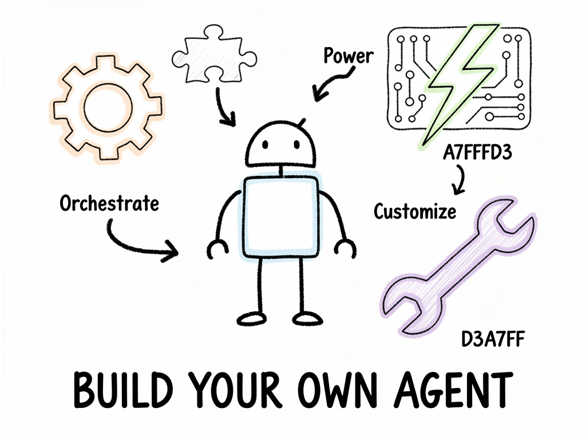
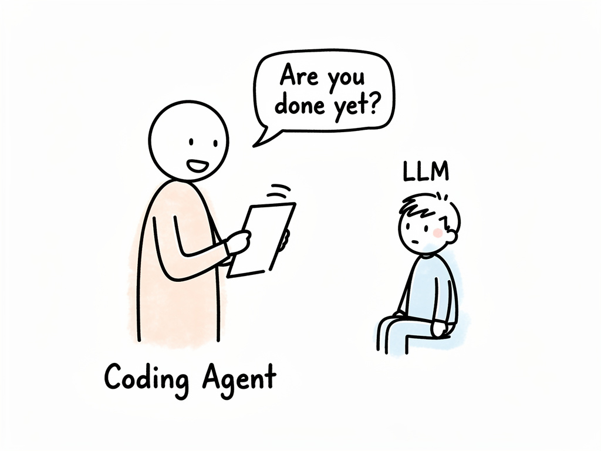
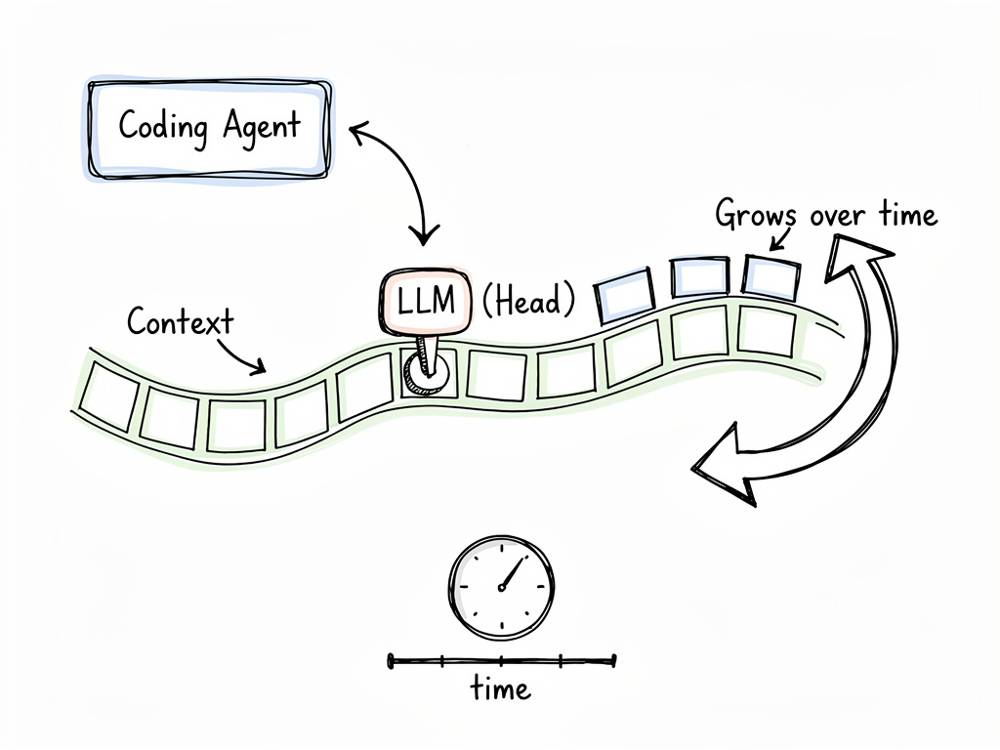
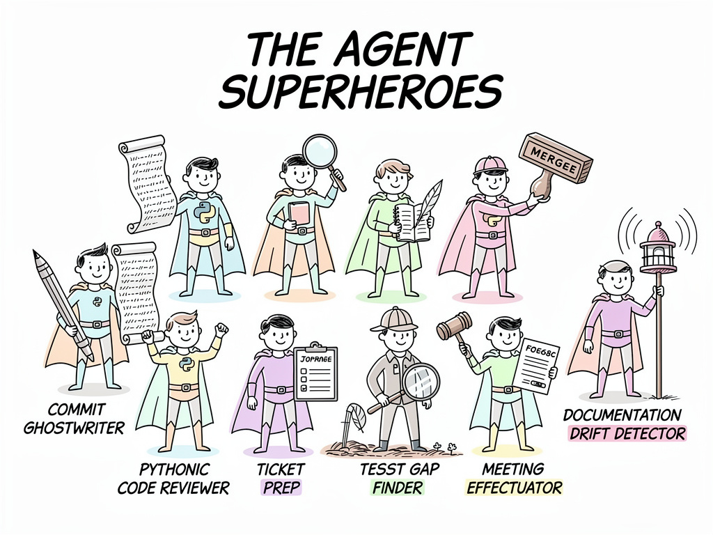

<h1 class="slidedeck-title">Hands-on session</h1>

**Joris Gillis**
Software Engineer @ TrendMiner

---

# Before we start

## **Goal?**

1. Have some fun together
2. Write a skill, agent, or plugin for Claude Code
3. Exposure to ecosystem of agents

---

# What to expect?

1. Terminology
2. Coding Agents (Claude Code)
3. How to build an agent/skill?
   a. Formats of agents
   b. Evaluation
   c. Distribution

---

# 1. Terminology

<h1 class="main-question">What is an Agent?</h1>

- **Autonomy**: the ability to act independently or
  semi-autonomously.
- **Tool Use**: Agents interact with external systems (APIs, apps, or
  data) to achieve goals.
- **Goal-Oriented**: Focus on completing tasks or workflows, not just
  generating responses.

<!-- --- -->

<!-- # 1. Terminology -->

<!-- <h1 class="main-question">Is Claude Code an agent or a harness?</h1> -->

<!-- ## Harness vs Agent -->

<!-- - Anthropic talks about Agent Skills & Subagents -->
<!-- - GitHub CoPilot talks about "Adding Custom Agents" -->
<!-- - [Agent Skills](https://agentskills.io/home): specification -->

---


---

<h1 class="main-question">What is Claude Code?</h1>

**Conceptually**



---



---


# How to influence a coding agent?


**Mark Down + Frontmatter**

1. **AGENTS.md**: *general* instructions, always used
   - E.g., programming language, style, tools, ...
2. **Skill**: *specific* instructions, used based on description
   - E.g., test driven development, debugging, specific framework, ...
3. **Subagent**: *specific* instructions, *separate* context
   - E.g., exploring, reviewing, debugging, ...

--- 

# AGENTS.md

- Describe
  - General guidelines
  - Project goal
  - Project structure
- E.g., programming language, tools to use, skills to definitely use, ...
- Always loaded into the context

---

# Subagent

- Claude Code: `/agents`
- Separate context, different model
- Use: when output of agent is small compared to input
- E.g., code review -> reads many files, has small list of comments

```markdown
---
name: code-reviewer
description: Reviews Python code and suggests improvements as a true Pythonista.
allowed-tools: Bash(git:* ) Read Grep Bash(find:* ) Bash(ls:* ) 
context: fork
model: inherit
memory: project
background: true

---
```

---
  
# Skill

- Claude Code: `/skills`
- Works in main context
- SKILL.md + references + scripts + extra
- Use: add domain-specific knowledge to the main context
- E.g., test-driven development -> change behaviour of the agent
- Put in `~/.agents/skills` directory (or `~/.claude/skills`)

---

# How to write a skill?

- Start: /skill-creator (skill in Claude Code)
- [Claude documentation](https://code.claude.com/docs/en/skills)
- **Evals**!
  - built into skill-creator
  - [promptfoo](https://www.promptfoo.dev/)

---

# Distributing your agent skill

- Claude Code: use plugins
  - `.claude-plugin/plugin.json`
  - `/plugin`
- Generic: [Agent Package Manager
  (APM)](https://microsoft.github.io/apm/getting-started/quick-start/)

---

# Agents outside of Coding Agents

- Frameworks to build autonomous agents
  - LangChain
  - DSPy
  - Claude Agent SDK
  - ...

---



---

# Thank you!

**Slides & Exercises:**
[github.com/jorisgillis/agentic-ai-meetup](https://github.com/jorisgillis/agentic-ai-meetup)


---

# PromptFoo

- Framework for evaluating
  - Prompts, Models, RAG
- Consider it integration testing for prompts (aka skills)
- [Docs](https://www.promptfoo.dev/docs/intro/)

---

# More pointers

- Harnesses
  - [OpenCode](https://opencode.ai/) 
  - [Pi.dev](https://pi.dev/) (open source harnesses with more customizability)
- Skills
  - [Best practices from Agentskills.io](https://agentskills.io/skill-creation/best-practices)
  - [Skill-Creator skill](https://github.com/anthropics/skills/tree/main/skills/skill-creator)
- Other
  - [DSPy](https://dspy.ai/): structured agents
  - [Evals](https://developers.openai.com/blog/eval-skills)

